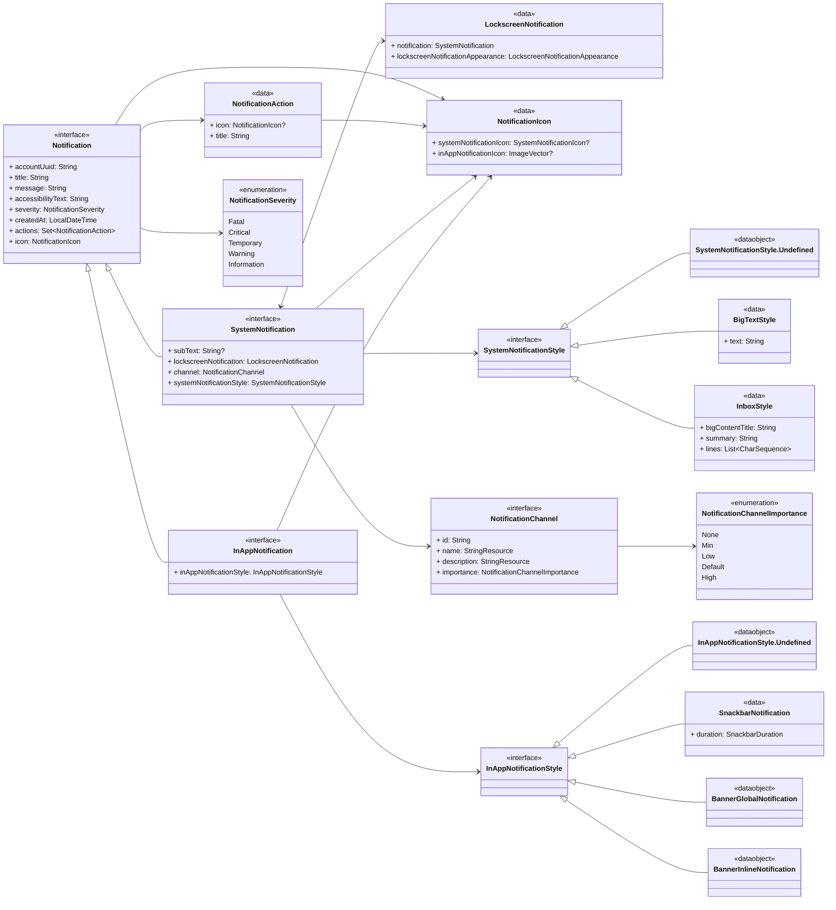
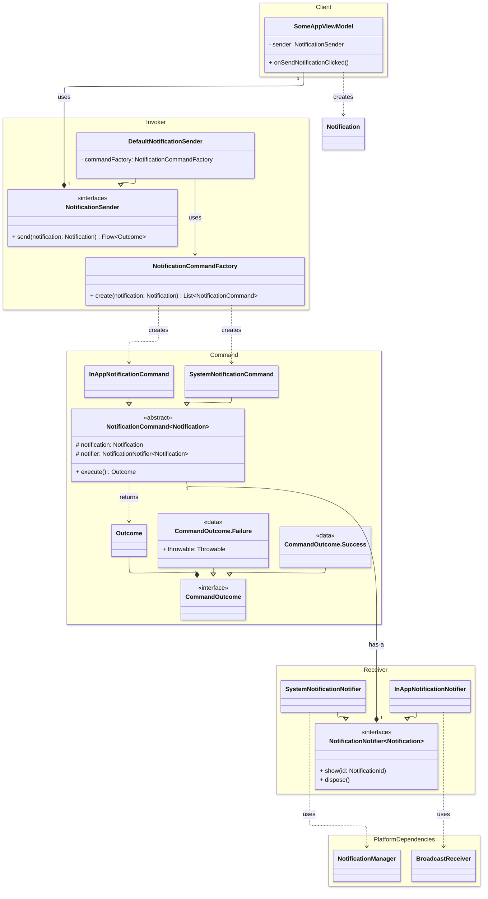
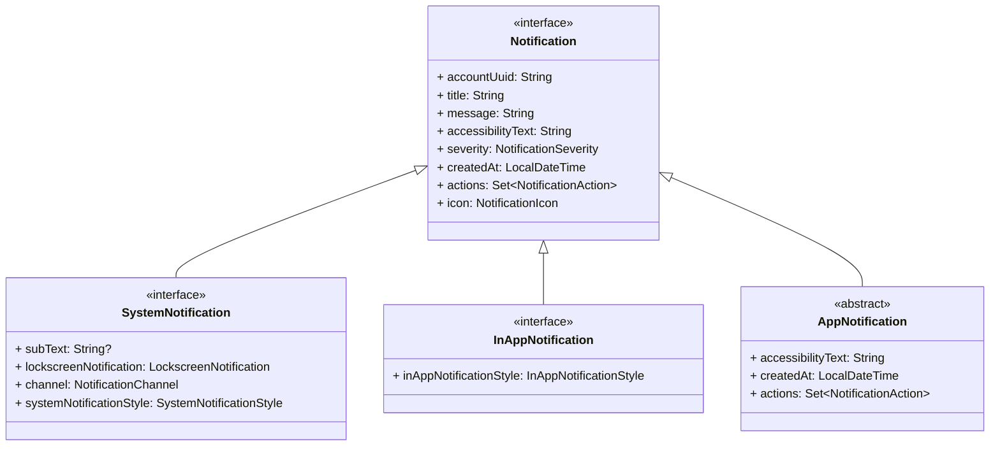
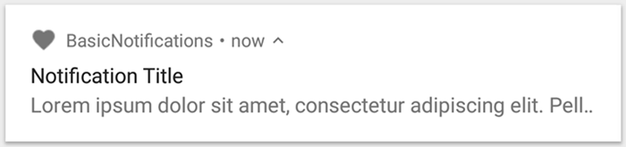
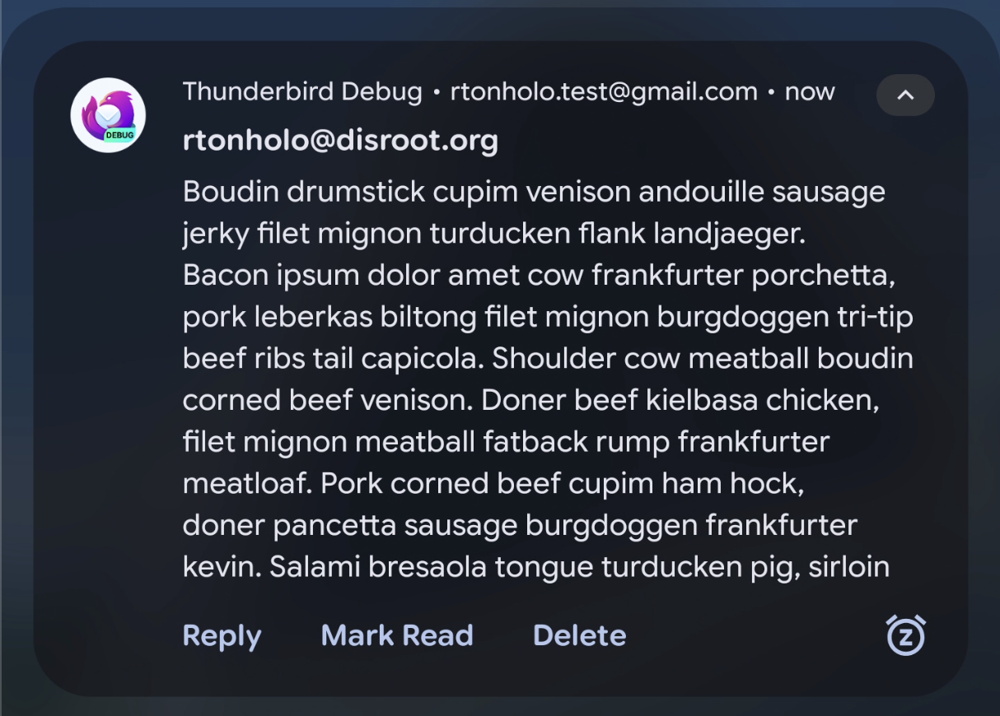

# Thunderbird Notification Module

This module provides a flexible and extensible Notification system for Thunderbird for Android. The core idea is to
provide an easy way to deliver a notification to multiple Notification providers.

## Architecture

The notification system is organized into two modules:

- **api**: Core interfaces and classes
- **impl**: The implementation module
- **testing**: The

## 🏗️ Core Components

### 🎲 The Notification Data Model

Before diving into the logic, it's important to understand the data that flows through the system. This is represented
by the `Notification` data model, which acts as the central payload for all operations



- **Core `Notification` Interface**: At the top level is the `Notification` interface, which contains properties common
  to all notification types, such as `title`, `text`, `severity`, and a list of `NotificationAction`s. The
  `Notification` interface should never be directly implemented.
- **Specialized Notification Types**: To handle platform differences, the base interface is extended by two specialized
  interfaces:
    - **`SystemNotification`**: Represents a standard Android OS notification. It includes properties for
      Android-specific features like the `NotificationChannel` and a `SystemNotificationStyle`.
    - **`InAppNotification`**: Represents a message shown inside the app's UI. It includes its own
      `InAppNotificationStyle`.
- **Flexible Styling and Actions**: A key feature of the model is its use of polymorphism for styling. This allows the
  UI to be defined by data, not hard-coded logic.
    - `SystemNotificationStyle` can be a `BigTextStyle` or `InboxStyle`, mapping to native Android features.
    - `InAppNotificationStyle` can be `SnackbarNotification`, `BannerInlineNotification`, or
      `BannerGlobalNotification`.

### 📢 Notification System Architecture

This system is responsible for creating and dispatching all user-facing notifications, including system tray
notifications and in-app messages.

At its core, this system uses the **Command Design Pattern**. The primary goal of this architecture is to **decouple**
the request for a notification from the underlying platform-specific code that displays it. This makes the system more
flexible, testable, and easier to extend.



The architecture is divided into four main logical groups: **Client**, **Invoker**, **Command**, and **Receiver**.

#### 📱 The Client

In the classic Command Pattern, the Client is often responsible for creating the command and setting its receiver.
However, in our implementation, the Client's role is simplified.

- **Implementation:** Any `ViewModel` (e.g., `ProfileViewModel`, `SettingsViewModel`).
- **Responsibilities:**
    - Constructs a concrete `Notification` data object based on user action or business logic.
    - Holds a reference to the `NotificationSender` (the [Invoker](#-the-invoker)).
    - Calls `notificationSender.send()` to initiate the request.
    - Consumes the `Flow<Outcome>` to react to the result.

#### 🎛️ The Invoker

The **Invoker** holds a command and asks it to be executed. It is completely decoupled from the action itself.

- **Implementation:** `NotificationSender` (Interface) and `DefaultNotificationSender` (Concrete Class).
- **Responsibilities:**
    - The `DefaultNotificationSender` implements the `NotificationSender` interface.
    - It uses the `NotificationCommandFactory` to get the correct command instances.
    - It calls the `execute()` method on the command list it receives from the factory.

#### 📦 The Command

The **Command** object encapsulates all the information required to act.

- **Implementation:** `NotificationCommand` (abstract base), with concrete classes like `SystemNotificationCommand` and
  `InAppNotificationCommand`.
- **Responsibilities:**
    - Binds together a `Notification` (the payload) and a `NotificationNotifier` (the Receiver).
    - Provides a common `execute()` interface that the Invoker can call without knowing the specific details of the
      command.

#### 🎯 The Receiver

The **Receiver** knows how to perform the work required to carry out the request. It's where the business logic lives.

- **Implementation:** `NotificationNotifier` (interface), with concrete classes like `SystemNotificationNotifier` and
  `InAppNotificationNotifier`.
- **Responsibilities:**
    - Contains the platform-specific implementation for displaying a notification.
    - `SystemNotificationNotifier` uses the Android `NotificationManager`.
    - `InAppNotificationNotifier` uses a `BroadcastReceiver` to show a message within the app.

## 🛠️ How to Use the System

#### Defining the Notification Type

The notification type creation plays a key part in the new system to make it easier whenever we need to trigger a
notification. In this section, you will learn everything you need to define a notification type, including understanding
what types to use, when to use them, and what the required fields are.

### Notification Types

We currently have two types of notifications, `SystemNotification` and `InAppNotification`, and both inherit the base
`Notification` interface, as shown in the diagram:



Additionally, we have a helper abstract class that overrides and implements some of the properties present in the
`Notification` interface that might commonly be implemented in all the notifications we have, such as `createdAt` and
`accessibilityText`.

Although it is not a must, extending the `AppNotification` will help you to define your new type.

#### Choosing the correct type: `SystemNotification` or `InAppNotification`? Both?

Before choosing, we need to understand what a `SystemNotification` and an `InAppNotification` are.

- `SystemNotification` is a kind of notification that the Android OS will display to the user. Any notification of this
  type will require a system permission to be triggered, and it is up to the system to decide what the UI will look
  like.
- `InAppNotification` is a kind of notification displayed only within the app, meaning the app **must** be in the
  foreground for the user to be notified. This type of notification won't require any given permission from the user,
  and the UI is fully controlled by us.

Now that you know the difference between the two types, you need to answer the last question:

**When will this notification trigger?**

1. When the application is in the background? If yes, implement the `SystemNotification` interface in your type.
2. When the application is in the foreground? If yes, implement the `InAppNotification` interface in your type.
3. Both? If yes, you should implement both `SystemNotification` and `InAppNotification`

#### The notification severity

We use notifications mostly to communicate with the user about something that happened in the app. Depending on the
situation, we might need to use a more intrusive communication as something important has happened and the user's
attention is required. That is where the `NotificationSeverity` comes into place.

Every notification type **must** define its severity. Depending on the severity, the notification will behave
differently, as it requires more or less attention from the user. The notification severities are:

- Fatal
    - **When:** The issue completely blocks the user from performing essential tasks or accessing core functionality.
    - **User action:** Typically requires immediate user intervention to resolve the issue.
    - **Behaviour changes**:
        - `SystemNotification`s are not dismissable
        - `InAppNotification`s:
            - `BannerGlobalStyle` will display
              using [error colours](https://github.com/thunderbird/thunderbird-android/blob/main/core/ui/compose/theme2/thunderbird/src/main/kotlin/app/k9mail/core/ui/compose/theme2/thunderbird/ThemeColors.kt#L22)
    - **Example:**
        - **Notification Message:** Authentication Error
        - **Notification Actions:**
            - Retry
            - Provide other credentials
- Critical
    - **When:** The issue prevents the user from completing specific core actions or causes significant disruption to
      functionality.
    - **User Action:** Usually requires user action to fix or work around the problem.
    - **Behaviour changes**:
        - `SystemNotification`s are not dismissable
        - `InAppNotification`s:
            - `BannerGlobalStyle` will display
              using [error colours](https://github.com/thunderbird/thunderbird-android/blob/main/core/ui/compose/theme2/thunderbird/src/main/kotlin/app/k9mail/core/ui/compose/theme2/thunderbird/ThemeColors.kt#L22)
    - **Example:**
        - **Notification Message:** Sending of the message "message subject" failed.
        - **Notification Actions:**
            - Retry
- Warning
    - **When:** Need to alert the user to a potential issue or limitation that may affect functionality if not
      addressed.
    - **User action:**
        - User action is often recommended to prevent future problems or to mitigate current limitations.
        - The action might be to adjust settings, update information, or simply be aware of a condition.
    - **Behaviour changes**:
        - `SystemNotification`s are not dismissable
        - `InAppNotification`s:
            - `BannerGlobalStyle` will display
              using [warning colours](https://github.com/thunderbird/thunderbird-android/blob/main/core/ui/compose/theme2/thunderbird/src/main/kotlin/app/k9mail/core/ui/compose/theme2/thunderbird/ThemeColors.kt#L58)
    - **Example:**
        - **Notification Message:** Your mailbox is 90% full.
        - **Notification Actions:**
            - Manage Storage
- Temporary
    - **When:** A temporary disruption or delay to functionality occurred, which may resolve on its own.
    - **User action:**
        - User action might be optional or might involve waiting for the system to recover.
        - Informing the user about potential self-resolution is key.
    - **Behaviour changes**:
        - `SystemNotification`s are not dismissable
        - `InAppNotification`s:
            - `BannerGlobalStyle` will display
              using [information colours](https://github.com/thunderbird/thunderbird-android/blob/main/core/ui/compose/theme2/thunderbird/src/main/kotlin/app/k9mail/core/ui/compose/theme2/thunderbird/ThemeColors.kt#L48)
    - **Example:**
        - **Notification Message:** You are offline, the message will be sent later.
        - **Notification Actions:** N/A
- Information
    - **When:** Needs to provide status or context without impacting functionality or requiring action.
    - **User action:** Generally, no action is required from the user. This is purely for informational purposes.
    - **Behaviour changes**:
        - `SystemNotification`s are not dismissable
        - `InAppNotification`s:
            - `BannerGlobalStyle` will display
              using [information colours](https://github.com/thunderbird/thunderbird-android/blob/main/core/ui/compose/theme2/thunderbird/src/main/kotlin/app/k9mail/core/ui/compose/theme2/thunderbird/ThemeColors.kt#L48)
    - **Example:**
        - **Notification Message:** Last time email synchronization succeeded

#### Defining the Notification Type

##### System notifications

###### Step 1: Check Notification permission

System notifications require the user's permission to be displayed. The notification module, currently, doesn't verify
it automatically.

Using the `PermissionChecker`, you can verify if the app already has the `POST_NOTIFICATION` permission:

```kotlin
class CheckPermission(
    private val permissionChecker: PermissionChecker,
) : UseCase.CheckPermission {
    override fun invoke(permission: Permission): PermissionState {
        return permissionChecker.checkPermission(permission)
    }
}

class ViewModel(checkPermission: UseCase.CheckPermission) :
    BaseViewModel<State, Event, Effect>(initialState = State()) {
    init {
        updateState {
            it.copy(
                permissionState =
                    when (checkPermission(Permission.Notifications)) {
                        PermissionState.GrantedImplicitly ->
                            UiPermissionState.Unknown
                        PermissionState.Granted -> UiPermissionState.Granted
                        PermissionState.Denied -> UiPermissionState.Unknown
                    },
            )
        }
    }
}
```

###### Step 2: Define how the notification will display to the user

During the creation of the `SystemNotification` implementation, you can decide if you want to have a custom look by
overriding the `systemNotificationStyle` property.

By default, all System notifications are displayed by showing:

- An Icon
- A title
- A content text.



Meaning that its style is always `Undefined` (Basic notification), unless specified.

We currently support the following styles:

- `Undefined` (default)
- `BigTextStyle`
- `InboxStyle`

Next, we will show how to define each of the custom styles with examples.

**BigTextStyle:**
The `BigTextStyle` allows the app to display a larger block of text in the expanded content area of the notification.

The following code is how to define the System Notification with the `BigTextStyle` as its style:

```kotlin
data class NewMailSingleMail(
    // 1.
    override val accountUuid: String,
    val accountName: String,
    val summary: String,
    val sender: String,
    val subject: String,
    val preview: String,
    // 2.
    override val icon: NotificationIcon = NotificationIcons.NewMailSingleMail,
) : MailNotification() {
    // 3.
    override val title: String = sender

    // 4.
    override val contentText: String = subject

    // 5.
    override val systemNotificationStyle: SystemNotificationStyle =
        systemNotificationStyle {
            bigText(preview)
        }
}
```

1. We first define all the data we need to create our system notification
2. We set our icon, which will be shown in the system tray bar (Android 16+ will display only in the system tray if not
   expanded)
3. The `title` property is used to display the first text line in the notification, which we choose to be the `sender`
   this time
4. The `contentText` property is used to display the notification's content text when the notification is in the
   collapsed mode
5. Finally, we define that this System Notification will have the BigTextStyle, passing the `preview` String as a
   parameter, which is used to display the notification's content text when the notification is in the expanded mode

**System Notification with BigTextStyle collapsed:**


**System Notification with BigTextStyle expanded:**


> [!IMPORTANT]
> The System Notification UI may vary between Android OS versions and OEMs, but in general, they will always have the
> same look and feel, with some differences.
>
> The above screenshots were taken using Android 16 and a Pixel 7 Pro.

**InboxStyle:**
The `InboxStyle` is designed to be used when we need to display multiple short summary lines, such as snippets from
incoming emails, grouping them all into one notification.

The following code is how to define the System Notification with the `InboxStyle` as its style:

```kotlin
@ConsistentCopyVisibility
data class NewMailSummaries private constructor(
    override val accountUuid: String,
    // 1.1.
    override val title: String,
    // 1.2.
    override val contentText: String,
    // 2.1
    val expandedTitle: String,
    // 2.2
    val summary: String,
    // 2.3
    val lines: List<String>,
    // 3.
    override val icon: NotificationIcon = NotificationIcons.NewMailSummaries,
) : MailNotification() {
    // 4.
    override val systemNotificationStyle: SystemNotificationStyle = systemNotificationStyle {
        inbox {
            title(expandedTitle)
            summary(summary)
            lines(lines = lines.toTypedArray())
        }
    }

    // 5.
    companion object {
        suspend operator fun invoke(
            accountUuid: String,
            accountDisplayName: String,
            previews: List<String>,
        ): NewMailSummaries = NewMailSummaries(
            accountUuid = accountUuid,
            title = getPluralString(
                resource = Res.strings.new_mail_summaries_collapsed_title,
                quantity = messageSummaries.size,
                messageSummaries.size,
                accountDisplayName,
            ),
            contentText = getString(Res.strings.new_mail_summaries_content_text),
            expandedTitle = getPluralString(
                resource = Res.strings.new_mail_summaries_expanded_title,
                quantity = messageSummaries.size,
                messageSummaries.size,
            ),
            summary = getString(
                resource = Res.strings.new_mail_summaries_additional_messages,
                messageSummaries.size,
                accountDisplayName,
            ),
            lines = previews,
        )
    }
}
```

```xml

<resources>
    <plurals name="new_mail_summaries_collapsed_title">
        <item quantity="one">You've received %1$d new message on %2$s</item>
        <item quantity="other">You've received %1$d new messages on %2$s</item>
    </plurals>
    <string name="new_mail_summaries_content_text">Expand to preview</string>
    <plurals name="new_mail_summaries_expanded_title">
        <item quantity="one">%1$d new message</item>
        <item quantity="other">%1$d new messages</item>
    </plurals>
    <string name="new_mail_summaries_additional_messages">+ %1$d more on %2$s</string>
</resources>
```

1. We first define all the default data we need to create our system notification:
    1. The `title` property is used to display the first text line in the notification when the notification is
       collapsed
    2. The `contentText` property is used to display the notification's content text when the notification is in the
       collapsed mode
2. Now we define the data used to fill our custom style, `InboxStyle`:
    1. The `expandedTitle` property is used to display the first text line in the notification when the notification is
       expanded
    2. The `summary` property is used to display the notification's first line of text after the detail section in the
       big form of the template.
    3. The `lines` property is used to display the previews in the digest section of the Inbox notification.
3. We set our icon, which will be shown in the system tray bar (Android 16+ will display only in the system tray if not
   expanded)
4. We now define that this System Notification will have the `InboxStyle`, via the `systemNotificationStyle` DSL
   function, consuming all the data we received via the constructor.
5. As some of the content from this notification is composed by a string/plural resource, we need to use a factory
   function. See more information
   in [Using String/Plural Resources to compose the notification](#using-stringplural-resources-to-compose-the-notification).

##### In-App notifications

TBD.

##### Using String/Plural Resources to compose the notification

TBD.

### 🔔 Sending a Notification

Sending a notification from a `ViewModel` involves three simple steps.

#### Step 1: Inject the `NotificationSender`

First, get an instance of the `NotificationSender` interface in your `ViewModel`, through dependency injection.

```kotlin
// MyViewModel.kt
class MyViewModel(
    private val notificationSender: NotificationSender,
) : ViewModel() {
    // ... 
}

// KoinModule.kt
val myFeatureModule = module {
    // ...
    viewModel {
        MyViewModel(
            // ...
            notificationSender = get(),
        )
    }
}
```

#### Step 2: Create a Notification and Send It

Construct a `Notification` data object, using the concrete implementation of it and pass it to the `sender`. The sender
will dispatch it and return a `Flow` of the operation's outcome.

#### Step 3: Collect the Outcome

Collect the `Flow` to react to the `Success` or `Failure` of the notification command.

```kotlin
// MyViewModel.kt
class MyViewModel(
    // ...
    private val notificationSender: NotificationSender,
) : ViewModel() {
    // ... 
    fun onSomethingHappened() {
        viewModelScope.launch {
            // 1. Retrieve the required data for the notification
            val accountNumber = ...
            val accountUuid = ...
            val accountDisplayName = ...
            // 2. Create the notification data
            val notification = AuthenticationErrorNotification(
                accountNumber = accountNumber,
                accountUuid = accountUuid,
                accountDisplayName = accountDisplayName,
            )

            // 3. Send and collect the outcome
            notificationSender
                .send(notification)
                .collect { outcome ->
                    outcome.handle(
                        onSuccess = { commandOutcome ->
                            logger.info {
                                "Command succeeded for notification ID: ${commandOutcome.command.notification.id}"
                            }
                            // Optionally update UI
                        },
                        onFailure = { error ->
                            logger.error(outcome.throwable) { "Command failed." }
                            // Optionally show an error message
                        },
                    )
                }
        }
    }
}
```

### How to display the Notification to the user
