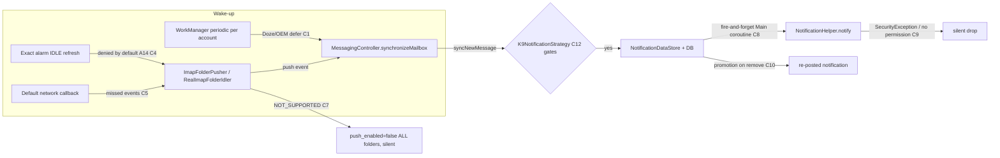
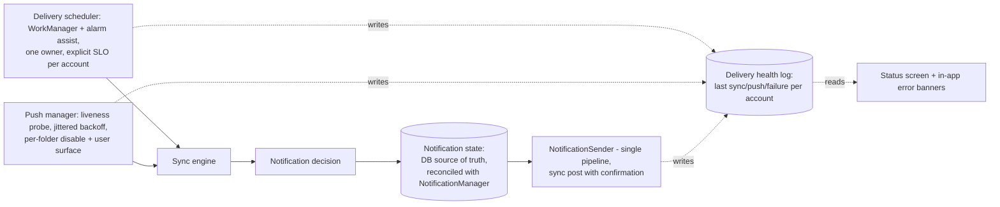

# Notification Delivery - Root Cause Report

- **Date:** 2026-07-17
- **Repository:** `thunderbird/thunderbird-android` @ `main` (versionName 23.0, `f5d36f7c53`)
- **Scope:** Why users do not receive (or receive late, wrong, or sticky) new-mail notifications. Companion document: `reports/notification-issues-triage.md` (issue inventory and prioritization).
- **Method:** Evidence-first. Every cause below cites file:line in the current tree, verified directly; regression candidates cite commit hashes with release-ancestry checks. No code was modified.

**Headline:** There is no single "notification bug". Delivery is a chain - *scheduler wakes app -> sync fetches mail -> strategy decides -> notification posts -> state stays consistent* - and every link has at least one defect. The dominant failures are: (1) polling has zero defenses against Doze/App Standby/OEM killers and misses its own rescheduling hooks; (2) push depends on an exact-alarm permission that Android 14+ denies by default and that the app only requests through a silent, minimum-priority notification; (3) push self-disables account-wide, silently, on one bad server response; (4) since 17.0 the actual `notify()` call is a fire-and-forget coroutine that a finishing background process can lose; and (5) all failures are invisible - the app almost never tells the user (or the logs) that delivery is broken.

---

## 1. Symptoms

User-visible failure classes, consolidated from the 123-issue sweep (see triage report for full mapping):

| ID | Symptom | Representative issues |
|----|---------|----------------------|
| S1 | Mail is not fetched on the configured poll interval while the screen is off; fetch happens on unlock/app open | #7839, #9898, #8849, #10212, #9326, #9526 |
| S2 | Push (IMAP IDLE) delivers late (~up to the refresh interval) or dies entirely after a network switch, process kill, or app update, until the user toggles something | #8434, #9239, #9520, #8751, #5593, #9216 |
| S3 | Mail IS fetched (visible in app, badge updates) but no system notification appears; regression window ~17.0 | #10890, #10098, #11017 |
| S4 | Push setting turns itself off, or push never works after settings import; no explanation shown | #10208, #8549, #8462 |
| S5 | Notification actions (delete/mark-read) leave the notification in the shade, or dismissed notifications reappear | #10936, #11065, #9317, #10983, #10089 |
| S6 | Configured notification actions are ignored; delete button cannot be enabled | #11076, #11130 |
| S7 | Sync silently stops forever (auth/parser/server errors); user discovers days later | #9424, #4227, #7589, #5315 |
| S8 | New/never-opened folders never produce notifications until manually loaded; per-folder opt-in makes delivery unconfigurable at scale | #10662, #10079, #8578-adjacent |
| S9 | QA/maintainers cannot reproduce most of the above on stock devices ("worksforme") | #11017, #10713, #9154 |

---

## 2. Causes

Concrete defects, each with code evidence. Confidence: **Confirmed** = read in current source; **Strong** = code + issue evidence line up; **Plausible** = mechanism exists, needs a repro.

### C1. Polling is a bare WorkManager periodic job with no platform mitigation [Confirmed -> S1]
- `MailSyncWorkerManager.scheduleMailSync` (`legacy/core/src/main/java/com/fsck/k9/job/MailSyncWorkerManager.kt:34-73`): plain `PeriodicWorkRequest` per account, constraints only `NetworkType.CONNECTED` + `setRequiresStorageNotLow(true)` (:44-45). No `setExpedited`, no foreground info, no exact-alarm assist, no battery-optimization detection (`isIgnoringBatteryOptimizations` appears nowhere in the repo).
- Periodic jobs are deferred to Doze maintenance windows and throttled by App Standby buckets; OEM skins (Samsung "Optimized", vivo, Xiaomi) go further. The user log in #9526 shows zero WorkManager activity between 21:13 and 05:18. Nothing in the code counteracts, detects, or reports this.
- Periodic sync also runs **without any wake lock**: `performPeriodicMailSync` calls `checkMail(account, false, false, true, ...)` (`legacy/core/src/main/java/com/fsck/k9/controller/MessagingController.java:2334`), and the wake-lock branch (:2373-2382) only runs for manual refresh.
- `MessagingController.performPeriodicMailSync` blocks on `latch.await()` with no timeout (:2349); an interrupted/hung sync is swallowed (:2351-2353).

### C2. Missed polls are never caught up while the process lives [Confirmed -> S1]
- The `lastSyncTime`-based catch-up (initial delay 0 when overdue, `MailSyncWorkerManager.kt:87-97`) only executes when scheduling runs, and scheduling only runs on **cold app start** (`Core.setServicesEnabled` from `BaseApplication.onCreate` -> `Core.kt:82-84`) or on specific settings writes. There is no `ProcessLifecycleOwner` ON_START hook (`app-common/src/main/kotlin/net/thunderbird/app/common/BaseApplication.kt:77` registers only a logging observer), so bringing the app to the foreground does not trigger an overdue sync.
- `BootCompleteReceiver.onReceive` only calls `pushController.init()` (`legacy/core/src/main/java/com/fsck/k9/controller/push/BootCompleteReceiver.kt:14-22`); it never reschedules poll workers - and the receiver is `android:enabled="false"` unless push services happen to be running (`legacy/common/src/main/AndroidManifest.xml:214-224`, enabled/disabled in `PushController.startServices/stopServices` at `PushController.kt:267,276`).
- `enqueueUniquePeriodicWork(..., ExistingPeriodicWorkPolicy.REPLACE, ...)` (`MailSyncWorkerManager.kt:69`) plus a redundant cancel (`K9JobManager.kt:29-32`) resets the periodic timer on every cold start.

### C3. Changing the poll interval in the NEW settings UI does not reschedule anything [Confirmed -> S1]
- `UpdateFetchingMailSettings` handles `UpdateFolderPollFrequency` by `account.copy(automaticCheckIntervalMinutes=...)` + `repository.update(...)` only (`feature/account/settings/impl/src/main/kotlin/net/thunderbird/feature/account/settings/impl/domain/usecase/UpdateFetchingMailSettings.kt:43-45,86`). No module under `feature/` or `core/` references `K9JobManager`.
- `Preferences.saveAccount` notifies `AccountsChangeListener`s, but the registered listeners are `PushController` and `NotificationChannelManager` - nothing reschedules the `MailSync` worker. The legacy preference screen did this explicitly (`legacy/ui/legacy/src/main/java/com/fsck/k9/ui/settings/account/AccountSettingsDataStore.kt:155-158, 226-228`); the new screen lost it. A user who sets "every 2 hours" keeps the old schedule until the next process cold start (matches #9898: "started after the latest update").
- Same class of bug, execution side: the worker treats `interval <= 0` as disabled while the scheduler treats `<= -1` as disabled (`MailSyncWorker.kt:69-70` vs `MailSyncWorkerManager.kt:78-85`).

### C4. Push refresh requires exact alarms; Android 14+ denies them by default; the app asks via a notification nobody sees [Confirmed -> S2, S4]
- The IDLE refresh alarm is scheduled exclusively with `AlarmManagerCompat.setExactAndAllowWhileIdle` (`legacy/common/src/main/java/com/fsck/k9/backends/AndroidAlarmManager.kt:67-73`) - no inexact fallback, no `canScheduleExactAlarms()` check and no try/catch at the call site.
- The permission gate lives in `PushController.updatePushers` (`PushController.kt:166,173-176`): when `canScheduleExactAlarms()` is false, push accounts are forced empty (push fully suspended) and the state becomes `ALARM_PERMISSION_MISSING` (:231-234).
- The ONLY grant path is tapping the persistent push notification (`PushNotificationManager.getContentIntent` builds `ACTION_REQUEST_SCHEDULE_EXACT_ALARM`, `legacy/core/src/main/java/com/fsck/k9/notification/PushNotificationManager.kt:79-97`). That notification is `setOngoing(true).setSilent(true)`, `PRIORITY_MIN`, on an `IMPORTANCE_LOW` channel (:63-77, `NotificationChannelManager.kt:92-105`) - and if `POST_NOTIFICATIONS` was denied, it is not visible at all. There is no dialog, no settings banner, no onboarding step.
- Android 14 denies `SCHEDULE_EXACT_ALARM` by default for newly installed apps targeting API 33+ and sets it to denied after backup-restore transfers; this app targets SDK 35 (`build-plugin/src/main/kotlin/ThunderbirdProjectConfig.kt:10`). The settings-import path never requests it: `SettingsImporter.kt` contains no push/alarm/permission calls, and `AccountSettingsWriter.write` ends at `Core.setServicesEnabled` (`legacy/core/src/main/java/com/fsck/k9/preferences/AccountSettingsWriter.kt:109`) which schedules poll workers only. This is exactly the #8549 pattern ("imported from K-9, push dead, never asked for alarms").
- `USE_EXACT_ALARM` is not declared (correct - app would not pass Play policy for it), so the permission UX is the only lever, and it is broken.

### C5. A silently-dead IDLE socket is only noticed after the full refresh interval (default 24-26 min) [Confirmed -> S2]
- During IDLE the socket read timeout is `idleRefreshTimeoutMs + 2 min` (`mail/protocols/imap/src/main/java/com/fsck/k9/mail/store/imap/RealImapFolderIdler.kt:8,113,187-189`); the refresh alarm fires after `idleRefreshMinutes` (default 24, `DefaultAccountDefaultsProvider.kt:69`; UI range 2-60 min).
- Recovery from connectivity changes relies solely on `registerDefaultNetworkCallback` (`core/android/network/src/main/kotlin/net/thunderbird/core/android/network/ConnectivityManagerApi24.kt:41` -> `PushController.onConnectivityChanged` -> `reconnect()`, `PushController.kt:127-137`). If the callback is missed or the socket dies without a network event (NAT/router drop, Doze), worst-case new-mail latency equals the refresh interval - matching user reports that lowering "Refresh IDLE connection" to 2 min "fixes" delays (#9239 thread), at a battery cost.
- Error retry is a flat 5 min (I/O) or 60 min (auth/unexpected) timer (`backend/imap/src/main/java/com/fsck/k9/backend/imap/ImapBackendPusher.kt:20-21,190-226`) with no jitter and no user surface.

### C6. Push does not survive process death, app update, or a denied FGS start - silently [Confirmed -> S2]
- Auto-restart swallows `ForegroundServiceStartNotAllowedException` (Android 14+ background-start restriction) with only a log (`PushService.kt:50-63`, referencing issue #7416); `PushServiceManager.startService` catches ALL exceptions and logs (`PushServiceManager.kt:43-54`). Result: the "bell" state machine believes push is running while no IDLE connection exists - the exact behavior in #8751 ("bell reappears, no push until I tap it").
- The `BOOT_COMPLETED`/`MY_PACKAGE_REPLACED` receiver is enabled only while push services run (C2). Poll-only or currently-stopped-push installs get nothing after reboot/update; push-only accounts have no poll fallback at all (`MailSyncWorkerManager.kt:78-85` skips accounts with interval "never"). #5593 (update kills push until app opened) follows directly.

### C7. One bad server response silently disables push for the whole account [Confirmed -> S4]
- `RealImapFolderIdler` returns `NOT_SUPPORTED` both when IDLE is genuinely missing (:76-79) AND when the server answers the IDLE command with a tagged response without a continuation (:99-101) - which a flaky server/proxy can do transiently.
- That bubbles to `AccountBackendPusherCallback.onPushNotSupported` -> `folderRepository.setPushDisabled(accountId)` (`legacy/core/src/main/java/com/fsck/k9/controller/push/AccountBackendPusherCallback.kt:29-32`) -> `UpdateFolderOperations.setPushDisabled` which runs `db.update("folders", {push_enabled=false}, null, null)` - **null WHERE clause: every folder in the account** (`legacy/storage/src/main/java/com/fsck/k9/storage/messages/UpdateFolderOperations.kt:85-93`). The only trace is a verbose log line.
- Meanwhile `ImapBackend.isPushCapable` is unconditionally `true` (`backend/imap/src/main/java/com/fsck/k9/backend/imap/ImapBackend.kt:50`), so the UI happily offers the toggle again. User re-enables, cycle repeats: #10208 ("push option disables itself").

### C8. Since 17.0, posting a message notification is fire-and-forget on the Main dispatcher [Confirmed mechanism, Strong as the #10890 regression -> S3]
- Commit `1c037e5fab` "Show avatars on message notifications" (PR #9652; first shipped in 17.0 per release-ancestry check) made `SingleMessageNotificationCreator.createSingleNotification` a coroutine: `private val scope = CoroutineScope(SupervisorJob() + Dispatchers.Main.immediate)` and `fun createSingleNotification(...) = scope.launch { ... notificationHelper.notify(...) }` (`legacy/core/src/main/java/com/fsck/k9/notification/SingleMessageNotificationCreator.kt:24,30,64` - verified in current tree).
- The caller chain (`MessagingController.ControllerSyncListener.syncNewMessage:2786-2791` -> `NewMailNotificationController.processNewMailNotificationData`) runs synchronously on the sync thread and **does not await the launch**. The DB/store bookkeeping (message row, `notifications` table, `wasNotified` flag) completes synchronously; the actual `notify()` runs whenever the main looper gets to it, plus a suspend avatar lookup in between (:41,67-73).
- On a poll account the surrounding WorkManager job finishes immediately after; the process becomes cacheable and freezable (Android 11+ app freezer, Doze). Any post queued to Main that has not run yet is delayed until unfreeze or lost with the process. Push accounts keep a foreground service alive, so they rarely lose the race - matching #10890 precisely: poll-only, "since 17.0", mail present, badge (DB-driven) updates, no notification. `NewMailNotificationController`/decision code is unchanged since 16.0 (checked via git), making this the prime regression candidate.

### C9. Failed `notify()` calls are swallowed; POST_NOTIFICATIONS is never checked [Confirmed -> S3, S9]
- `NotificationHelper.notify` catches `SecurityException` (`legacy/core/src/main/java/com/fsck/k9/notification/NotificationHelper.kt:46-64`, introduced by `e9b9cc7cb4`, also first in 17.0): a channel referencing an inaccessible custom sound (typical after device restore / settings import) permanently drops the mail notification (an error notification is shown instead, on a different channel).
- No posting path checks `areNotificationsEnabled()`: neither `NotificationHelper.notify` nor the new `AndroidSystemNotificationNotifier.show` (`feature/notification/impl/src/androidMain/kotlin/.../receiver/AndroidSystemNotificationNotifier.kt:29-37`). With POST_NOTIFICATIONS denied (never granted, denied after backup restore - #8712, or revoked), `notify()` is a silent no-op while all internal state advances as if delivered. The permission is requested only in onboarding (`feature/onboarding/permissions/.../PermissionsScreen.kt:61`); #7554 (re-ask when enabling notifications) is still open.

### C10. The notification state machine cannot clear or keep notifications honestly [Confirmed -> S5]
- **No-op actions never dismiss:** `NotificationDataStore.removeNotifications` returns `null` when the message reference is no longer in the in-memory store (`legacy/core/src/main/java/com/fsck/k9/notification/NotificationDataStore.kt:129,132,197-199`); `NewMailNotificationController` then skips `NotificationManager.cancel` entirely. If the shade shows a notification whose store entry is already gone (prior sync marked it read, process restart rebuilt state, race), tapping "Mark as Read"/"Delete" performs the action but the notification stays - #11065, and the recurring flavor of #9317/#10089.
- **Removal re-posts:** removing an active notification while inactive ones exist promotes the newest inactive one into the freed slot and posts it as a fresh notification (`NotificationDataStore.kt:164-183`). With >9 pending messages (`MAX_NUMBER_OF_NEW_MESSAGE_NOTIFICATIONS = 9`, `NotificationDataStore.kt:7`), every dismissal/delete makes "a notification reappear" - the #10936 experience.
- **Group-dismiss semantics:** each child carries its own `ACTION_DISMISS` delete-intent while the summary's delete-intent wipes the account (`NotificationActionIntents.kt:43-56`); platform-dependent child-delete firing on group dismiss plus promotion explains #10983 (dismiss summary -> individual notifications appear).
- **Settings-change re-post:** saving account notification settings recreates the channel and calls `restoreNewMailNotifications` (`AccountSettingsDataStore.kt:210-220`).
- Dismissal is also never optimistic: `NotificationActionService.handleCommand` performs the (potentially slow, network-touching) messaging operation first and cancels afterwards (`legacy/core/src/main/java/com/fsck/k9/notification/NotificationActionService.kt:42-65`).

### C11. The actions users configure are only honored on one of three surfaces [Confirmed -> S6]
- Single-message notifications read `messageActionsOrder`/`messageActionsCutoff` (`SingleMessageNotificationDataCreator.kt:54-69`, feature `d708b7c91b`, shipped 19.0).
- Summary (2+ messages) notifications hard-code MarkAsRead + optional Delete (`SummaryNotificationDataCreator.kt:49-57,73-75`); Wear actions are hard-coded too (`SingleMessageNotificationDataCreator.kt:71-88`). Any inbox with more than one new mail shows the fixed set - #11076 ("config has no effect").
- The delete action additionally requires `notificationQuickDeleteBehaviour != NEVER` (`SingleMessageNotificationDataCreator.kt:122-124`), but **no settings screen exposes that value anymore**: `res/xml/general_settings.xml` contains no quick-delete preference (only quiet time, lock-screen visibility, and the actions screen at :452-517). A stored legacy `NEVER` (pre-v67 default was NEVER, `GeneralSettingsDescriptions.java:287-289`) is an inescapable trap - #11130.

### C12. The folder model defaults new folders (and everything but Inbox) to silent [Confirmed -> S8, feeds S1/S9]
- Newly discovered server folders get `isSyncEnabled=false, isNotificationsEnabled=false, isPushEnabled=false` (`legacy/core/src/main/java/com/fsck/k9/mailstore/FolderSettingsProvider.kt:16-32`); only the Inbox is special-cased to sync+notify on account setup (`DefaultSpecialFolderUpdater.updateInbox`, :65-84) - push is never enabled by default anywhere.
- Legacy sync additionally gates on visibility: a folder syncs only if `isVisible() && isSyncEnabled()` (`MessagingController.java:2445-2453`).
- First-ever sync of a folder suppresses all notifications (`suppressNotifications = lastChecked == null`, `MessagingController.java:672-679`) - correct anti-spam behavior, but combined with the above it produces #10662: a Junk/other folder never opened locally never notifies until the user loads it once.
- There is no global "sync/notify all folders" control (#10079; SPIKE #11083), so at 70-600 folders the model is uncontrollable.

### C13. Failures at every layer are invisible [Confirmed -> S7, S9, multiplies everything]
- Catch-and-log-only: FGS start (C6), boot-receiver enablement (`BootCompleteManager.kt:31-43`), `notify()` (C9), push auto-disable (C7), worker interrupt (C1). A folder whose sync aborts on a parser bug (`#7589`, ready failing test in the issue) simply never syncs again with a status line nobody reads (#4227, #9424). The in-app error-notification system that would surface these (epic #8831, tasks #9246-#9249) is designed but not shipped; push-state surfacing (#8830) likewise.

### C14. Two notification architectures exist; the documented one is dormant in every shipping build [Confirmed -> S9, structural]
- Feature flags (`core/featureflag/.../FeatureFlagKey.kt:13-15`): `use_notification_sender_for_system_notifications` is **true only in TB debug**; false in TB daily/beta/release and all K-9 builds (`app-thunderbird/src/{debug,daily,beta,release}/.../TbFeatureFlagFactory.kt:25-26`, `app-k9mail/src/{debug,release}/.../K9FeatureFlagFactory.kt`). `DisplaySystemNotificationCommand` hard-fails when the flag is off (`feature/notification/impl/.../command/DisplaySystemNotificationCommand.kt:38-47`).
- New-mail notifications have zero senders on the new path; only auth-error/in-app banners use it, partially. `feature/notification/docs/notification-architecture.md` describes components (e.g. `NotificationCommandFactory`) that do not exist and omits the flag gating - precisely the mismatch #11259 was filed to untangle. Debug builds therefore exercise different notification code than what users run, which invalidates internal testing and explains part of the `qa: worksforme` pattern (S9).

---

## 3. Reasons

Why the codebase is in this state - the forces behind the causes:

- **R1. 2010-era architecture meets 2024-era Android.** The delivery core (`MessagingController`, `LocalStore`, folder classes) predates Doze (API 23), App Standby buckets (API 28), exact-alarm gating (API 31/34), FGS types (API 34), and the cached-process freezer. Each platform tightening removed an implicit guarantee (processes live, alarms fire, jobs run on time) that the old design silently relied on. Mitigations were bolted on only where crashes forced it (FGS types, `8452cdaf04`), not where delivery quietly degrades.
- **R2. A half-finished migration doubled every seam.** Legacy vs modern folder storage read different column sets (`LocalStore.java:112-128` has no `push_enabled`; `RetrieveFolderOperations.kt:218-268` does); legacy settings screens reschedule jobs, new Compose screens do not (C3); legacy notification pipeline ships while the documented new one is flag-disabled (C14). Every seam is a place where one side forgot an obligation the other side used to fulfill.
- **R3. Silent-failure culture.** Broad catch-and-log around every platform interaction (C6, C9, C13) plus verbose-level logging for user-fatal events (C7) means the system cannot distinguish "healthy" from "broken" - neither for the user nor for maintainers reading issue reports without logs. This is the single biggest reason the issue tracker is full of unreproducible reports.
- **R4. Permission UX debt.** Three runtime gates (POST_NOTIFICATIONS, SCHEDULE_EXACT_ALARM, OEM battery exemptions) decide whether delivery works, and the app requests exactly one of them, once, during onboarding. Import/restore flows - the most common path for this user base migrating from K-9 - bypass even that (C4, C9).
- **R5. Per-folder opt-in model vs user expectations.** Users expect "notify me about new mail"; the model requires per-folder sync+notify+push enablement with hostile defaults for anything but Inbox (C12). The gap generates both missed notifications and the flood of settings-trap issues.
- **R6. Testing/observability gap.** Debug builds run different flags than release (C14); QA runs stock devices while failures concentrate on OEM battery managers (S9); there is no delivery-health telemetry-equivalent (even local) to confirm "last sync ran when promised".

---

## 4. Plan the fixes

Phased to match the team's own structure (#11056 quick fixes -> #11057 refactor). Per project TDD policy: each fix lands with a failing test first where feasible.

### Phase 0 - Surgical fixes (attach to #11056; days each)

| # | Fix | Evidence/target | Closes/helps |
|---|-----|-----------------|--------------|
| F0.1 | Await notification posting: make `createSingleNotification`/summary posting synchronous from the caller's perspective (e.g. `runBlocking` boundary in `NewMailNotificationController.processNewMailNotificationData`, or restructure avatar loading to be pre-fetched off-main and post synchronously). Test: unit test that `notify()` happened-before `addNewMailNotification` returns. | `SingleMessageNotificationCreator.kt:24-65` | #10890 (S3) |
| F0.2 | Reschedule on settings change from the new UI: call `K9JobManager.scheduleMailSync(account)` (via an abstraction) when `UpdateFolderPollFrequency` changes; audit all new-settings writes that used to reschedule in `AccountSettingsDataStore`. | `UpdateFetchingMailSettings.kt:43-45,86` | #9898-class (S1) |
| F0.3 | Scope `setPushDisabled` to the failing folder (`WHERE server_id = ?`), treat tagged-no-continuation as retryable (bounded retries) instead of NOT_SUPPORTED, and surface an error notification/in-app banner when push is auto-disabled. | `UpdateFolderOperations.kt:85-93`, `RealImapFolderIdler.kt:99-101`, `AccountBackendPusherCallback.kt:29-32` | #10208, #5594-class (S4) |
| F0.4 | Always cancel the tapped notification: include `notificationId` in action intents and cancel it directly in `NotificationActionService` even when the store lookup returns null (fallback `NotificationManagerCompat.cancel`). | `NotificationDataStore.kt:129-199`, `NotificationActionService.kt:42-65`, `K9NotificationActionCreator.kt` | #11065, part of #10936/#9317 (S5) |
| F0.5 | Check + log + surface POST_NOTIFICATIONS at post time; re-request when the user enables notifications (account settings) and after import/restore. | `NotificationHelper.kt:46-64`, `AndroidSystemNotificationNotifier.kt:29-37` | #7554, #8712 (S3/S9) |
| F0.6 | Exact-alarm request flow: dedicated screen/dialog when enabling push, after settings import with push folders, and a persistent in-app banner while missing; keep the notification path as fallback. | `SettingsImporter.kt`, `AccountSettingsWriter.kt:109`, `PushNotificationManager.kt:79-97` | #8549-class, #8434 (S2/S4) |
| F0.7 | Restore delivery after reboot/update for everyone: register `MY_PACKAGE_REPLACED`/`BOOT_COMPLETED` unconditionally (cheap receiver) to run `pushController.init()` + `scheduleAllMailJobs()`. | `BootCompleteReceiver.kt`, manifest :214-224 | #5593, #5808 (S1/S2) |
| F0.8 | Catch-up sync on foreground: `ProcessLifecycleOwner` ON_START -> if any account overdue (`lastSyncTime + interval < now`), enqueue an expedited one-time sync. | `BaseApplication.kt:77`, `MailSyncWorkerManager.kt:87-97` | #7839 UX (S1) |
| F0.9 | Restore the quick-delete preference UI (or migrate stored `NEVER` values to `ALWAYS` once) and apply configured actions to summary + Wear surfaces (or explicitly document the fixed summary set). | `general_settings.xml:452-517`, `SummaryNotificationDataCreator.kt:49-57` | #11130, #11076 (S6) |
| F0.10 | Merge the `<= 0` vs `<= -1` disabled-interval guards into one constant/predicate. | `MailSyncWorker.kt:69-70`, `MailSyncWorkerManager.kt:78-85` | hygiene (S1) |
| F0.11 | Fix the IMAP keyword parser bug (failing test provided in the issue). | `ImapResponseParser` | #7589 (S7) |

### Phase 1 - Reliability hardening (weeks; still pre-refactor)

1. **Delivery health model (do this first - it de-risks everything else).** Record per-account: last scheduled sync, last successful sync, last push connect, last failure+reason. Surface in a "delivery status" screen + `about:` style debug info, and in the in-app error system (#8831/#9246-#9249, #8830). Converts S7/S9 from guesswork into data.
2. **Poll resilience:** detect `isIgnoringBatteryOptimizations` = false and standby bucket (`UsageStatsManager.getAppStandbyBucket`), then (a) guide the user (OEM-specific steps, dontkillmyapp-style) and (b) where granted, back the periodic work with an exact-alarm assisted expedited one-time sync for intervals the user marked critical. Never silently accept multi-hour deferrals.
3. **Push resilience:** on network-change reconnect verified; add a cheap liveness probe (bounded NOOP/DONE round-trip) when the refresh alarm fires early after suspicious silence; exponential backoff with jitter in `ImapBackendPusher`; when FGS start is denied (C6), schedule a retry via WorkManager/alarm instead of swallowing; consider TCP keepalive on the IDLE socket.
4. **Import/restore parity:** a single post-import "delivery readiness" checklist (notifications permission, exact alarms, battery exemption, push folders present) shown to the user.

### Phase 2 - Structural (the #11057 refactor)

1. **One notification pipeline.** Finish the `NotificationSender` migration for new-mail notifications, roll the flag debug -> beta -> release with the InboxStyle chain (#11159-#11207), then delete the legacy path. Reconcile `notification-architecture.md` with reality first (#11259).
2. **Honest notification state.** Replace the in-memory-first store with a reconciling state machine: source of truth = DB `notifications` table, reconciled against `NotificationManager.activeNotifications` on process start and after every mutation; dismissal/action handling idempotent by design (kills the C10 family).
3. **Sync model redesign.** Account-level delivery policy (push/poll/manual + interval) with per-folder overrides, global "all folders" option (#11083/#10079), sane defaults for new folders; single scheduler component owning WorkManager + alarms with an explicit contract ("no account goes longer than X past its interval without either syncing or reporting why").
4. **Strategic delivery options:** IMAP NOTIFY (RFC 5465) to cover multi-folder push on one connection (#826); optional UnifiedPush transport (#5165); evaluate sub-15-min foreground-service polling for opt-in power users (#5513).

---

## 5. System design

### 5.1 Current delivery chain (with failure points)

### 5.2 Target shape (Phase 1-2)

Design principles: every wake-up path writes health state; every auto-disable is user-visible; posting is confirmed, not assumed; one component owns scheduling; permissions are preconditions checked at the moment the user opts in, not discovered later.

---

## 6. Resources

**Code (current tree, key evidence):**
- Poll: `legacy/core/src/main/java/com/fsck/k9/job/{MailSyncWorkerManager,MailSyncWorker,K9JobManager}.kt`; `legacy/core/src/main/java/com/fsck/k9/Core.kt:62-92`; `MessagingController.java:2331-2382,2445-2453`
- Push: `legacy/core/src/main/java/com/fsck/k9/controller/push/*` (esp. `PushController.kt:160-303`, `PushService.kt:30-94`); `backend/imap/src/main/java/com/fsck/k9/backend/imap/{ImapBackendPusher,ImapFolderPusher,BackendIdleRefreshManager}.kt`; `mail/protocols/imap/.../RealImapFolderIdler.kt`; `legacy/common/src/main/java/com/fsck/k9/backends/AndroidAlarmManager.kt`
- Notifications: `legacy/core/src/main/java/com/fsck/k9/notification/*` (esp. `K9NotificationStrategy.kt:25-100`, `NotificationDataStore.kt:43-212`, `SingleMessageNotificationCreator.kt`, `NotificationHelper.kt:46-72`, `NotificationActionService.kt:42-158`); `feature/notification/**` + `feature/notification/docs/notification-architecture.md`
- Settings/folders: `legacy/core/src/main/java/com/fsck/k9/mailstore/FolderSettingsProvider.kt`; `legacy/storage/.../messages/{Create,Update,Retrieve}FolderOperations.kt`; migrations `MigrationTo85-88`; `legacy/core/src/main/java/com/fsck/k9/preferences/{SettingsImporter,AccountSettingsWriter}.kt`; `feature/account/settings/impl/.../UpdateFetchingMailSettings.kt`
- Manifest/platform: `legacy/common/src/main/AndroidManifest.xml:19-33,214-242`; `build-plugin/src/main/kotlin/ThunderbirdProjectConfig.kt:7-11`

**Commits (regression anchors):** `1c037e5fab` + merge `46e1fc8866` (async avatar posting, 17.0); `e9b9cc7cb4` (notify() SecurityException swallow, 17.0); `949c73c1f1` (quiet-time enabled-flag fix for #9629, shipped 15.0); `d708b7c91b` (notification actions config, 19.0); `672e1af6ce` (NotificationSender flags, 14.0); `8452cdaf04` (specialUse FGS switch, 2025-01); `73ae228f70`/`423f7553a7` (exact-alarm handling, 6.802 window).

**Issues:** triage report `reports/notification-issues-triage.md`; team umbrellas #11056, #11057, #11059, #11083, #11250, #11259, #8830, #8831.

**Android platform documentation:**
- Exact alarms denied by default (A14): developer.android.com/about/versions/14/changes/schedule-exact-alarms (verified: denied for new installs targeting 33+; `SecurityException` from `setExact*`; backup-restore transfers set it to denied)
- FGS types + `specialUse`/`FOREGROUND_SERVICE_SPECIAL_USE` (A14): developer.android.com/about/versions/14/changes/fgs-types-required
- App Standby buckets and job/alarm deferral: developer.android.com/topic/performance/appstandby
- Doze: developer.android.com/training/monitoring-device-state/doze-standby
- dataSync FGS 6h limit (A15) and alternatives: developer.android.com/about/versions/15/changes/datasync-migration (note: `PushService` uses dataSync type only on API 29-33, `PushService.kt:71-72`, so the A15 limit does not bite; worth re-checking if types change)
- User-facing push setup doc referenced by maintainers: support.mozilla.org/en-US/kb/configure-push-email-thunderbird-android
- OEM background-killing catalog: dontkillmyapp.com
- Support-report friction points cited by the team: github.com/thunderbird/thunderbird-support-reports (lisa/2026/april.md)

---

## 7. Open questions

1. **#10890 confirmation.** C8 is the prime candidate but needs a repro: poll-only account, force-stop-free idle device, send mail, observe `MailSyncWorker` complete without a posted notification (adb `dumpsys notification` + logcat). Alternative/compounding candidate: C9 sound-URI swallow. A bisect between 16.1 (`9dfc10b2ce`) and 17.0 (`4cea36e9fa`) over `SingleMessageNotificationCreator` would settle it. Which does the team want first - repro or revert-style fix (F0.1 is safe regardless)?
2. **#10713 (Android 16 + message-list widget breaks notification actions).** No mechanism found in this pass. The widget providers are manifest-declared in the app modules and there is no `android:process` anywhere, so a process-isolation theory fails. Needs targeted investigation (PendingIntent interaction? Glance receiver in daily/debug is `exported="true"` - main-build providers differ).
3. **#9728 (FGS specialUse SecurityException on crDroid/A16).** The manifest has declared `FOREGROUND_SERVICE_SPECIAL_USE` since `8452cdaf04` (2025-01), well before app 12.1, and it is a normal (auto-granted) permission. Is this custom-ROM permission-grant breakage, or is there an install-order/upgrade path where the permission is not granted? Needs a device report with `dumpsys package` output.
4. **Battery budget for shorter defaults.** Lowering `idleRefreshMinutes` default (24 -> e.g. 12) and adding liveness probes narrows S2 but costs battery (#11211 watches the other side). What regression budget is acceptable, and do we have measurement infrastructure before changing defaults?
5. **Min-SDK / API strategy.** #11057 floats raising min SDK. Current floor is 23 (`ThunderbirdProjectConfig.kt:7`). Does the refactor assume 26+ (channels everywhere) or higher? This changes how much legacy notification code can be deleted.
6. **Play policy for `specialUse`.** The subtype justification ships in the manifest (:238-241); has the Play review constraint been re-validated for the A15/A16 targets, and is `remoteMessaging` a better-fitting declared type for IDLE push?
7. **F-Droid Gmail/OAuth cohort (#9424 thread).** Is the silent Gmail sync death correlated with F-Droid-signed builds' OAuth client? If so this is a distribution/config issue masquerading as a sync bug and needs its own comms.
8. **Backup-restore permission wipes.** Android 14 sets exact-alarm permission to denied on transfer, and POST_NOTIFICATIONS does not survive either (#8712). Should restore be treated as "first run" for the permission flow?

---

## 8. Comments

- The team's instinct in #11059/#11057 ("this will require a much larger change to how we manage syncing") is validated by the code: C1/C2/C12 are architectural, not bugs. But the report also shows that roughly half of the user pain (C3, C4-UX, C7, C8, C9, C10, C11) is fixable with small, testable patches **before** the refactor - and F0.1/F0.3/F0.6 alone would likely dent the "40% of complaints" figure measurably.
- The highest-leverage single investment is not a fix at all: it is the delivery-health surface (Phase 1.1). Every cluster in the tracker is full of "worksforme" closures because neither users nor QA can see which link of the chain broke. Health state turns every future report into a diagnosable one.
- Flag hygiene matters for trust: as long as `use_notification_sender_for_system_notifications` is debug-only, internal testing exercises a pipeline users never run (C14). Either flip daily/beta on and staff the InboxStyle chain (#11159-#11207), or keep debug aligned with release until the migration is resourced.
- Nothing in this report required mutating GitHub or the repo; the two reports under `reports/` are untracked working documents.
